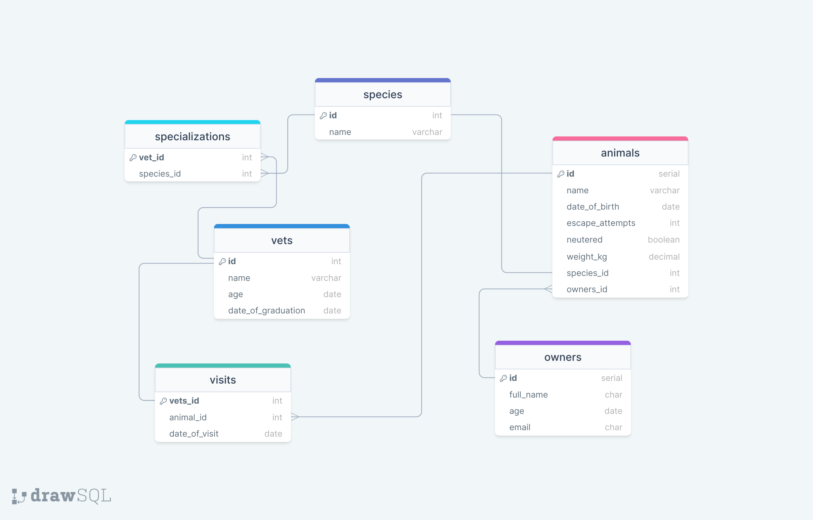

# 📖 Vet Clinic 

# 📗 Table of Contents

- [📖 About the Project](#about-project)
  - [🛠 Built With](#built-with)
    - [Tech Stack](#tech-stack)
    - [Key Features](#key-features)
  - [🚀 Live Demo](#live-demo)
- [💻 Getting Started](#getting-started)
  - [Setup](#setup)
  - [Prerequisites](#prerequisites)
  - [Install](#install)
  - [Usage](#usage)
  - [Run tests](#run-tests)
  - [Deployment](#triangular_flag_on_post-deployment)
- [👥 Authors](#authors)
- [🔭 Future Features](#future-features)
- [🤝 Contributing](#contributing)
- [⭐️ Show your support](#support)
- [🙏 Acknowledgements](#acknowledgements)
- [❓ FAQ](#faq)
- [📝 License](#license)

# 📖 Vet Clinic 

**Vet Clinic** is a a database that stores data about animals like name, date of birth and weight.

Here is a diagram showcase of the database:

## 🛠 Built With 

- [ ] SQL
- [ ] PostgreSQL 

### Tech Stack 

Database

  <ul>
    <li><a href="https://www.postgresql.org/">PostgreSQL</a></li>
  </ul>

### Key Features 

- **SQL selector**

(<a href="#readme-top">back to top</a>)

## 🚀 Live Demo 

- There is no live demo available yet

(<a href="#readme-top">back to top</a>)

## 💻 Getting Started 

To get a local copy up and running, follow these steps.

### Prerequisites

In order to run this project you need:

- [ ] PostgreSQL

### Setup

Clone this repository to your desired folder:

- https://github.com/Munyabelden/Vet-Clinic.git

### Install

Install this project with:

- PostgreSQL and VS code

### Deployment

You can deploy this project using:

- github pages

(<a href="#readme-top">back to top</a>)

## 👥 Authors 

👤 **Belden Mugauri**

- GitHub: [@githubhandle](https://github.com/Munyabelden/)
- Twitter: [@twitterhandle](https://twitter.com/munyaradzi045)

(<a href="#readme-top">back to top</a>)

## 🔭 Future Features 

- [ ] **More colums to my animals table**

(<a href="#readme-top">back to top</a>)

## 🤝 Contributing 

Contributions, issues, and feature requests are welcome!

Feel free to check the [issues page](https://github.com/Munyabelden/Vet-Clinic/issues).

(<a href="#readme-top">back to top</a>)

## ⭐️ Show your support 

If you like this project live a star

(<a href="#readme-top">back to top</a>)

## 🙏 Acknowledgments 

I would like to thank Microverse.

(<a href="#readme-top">back to top</a>)

## 📝 License 

This project is [MIT](https://github.com/Munyabelden/Vet-Clinic/blob/develop/LICENSE) licensed.

(<a href="#readme-top">back to top</a>)

